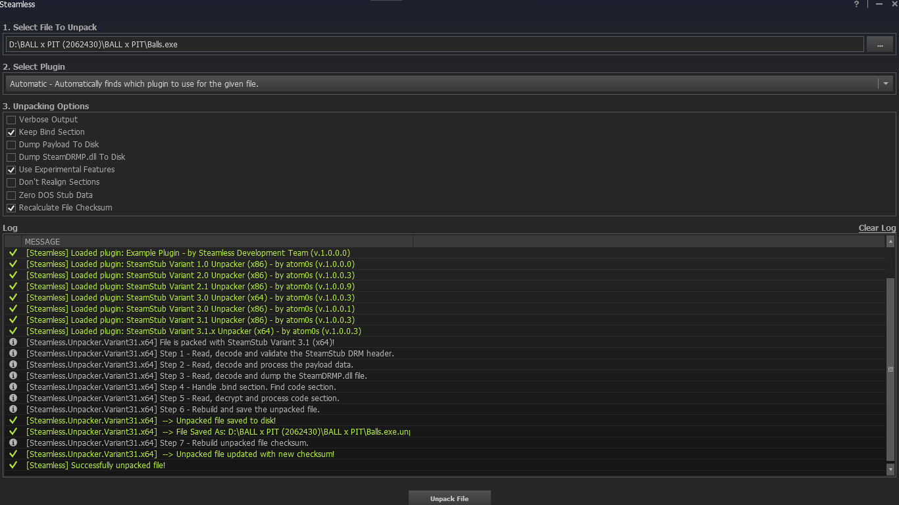
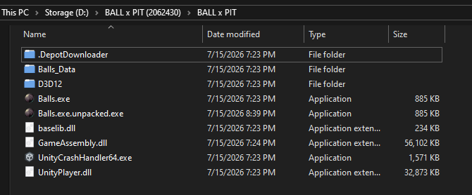
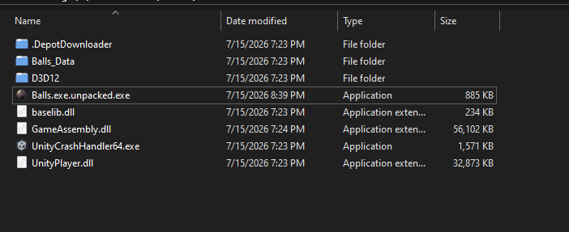
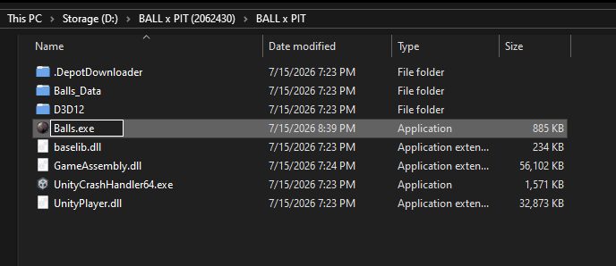

# BALL x PITT quacking guide by sai (***kaneki***)

1. extract the folder from zip
2. run the download.bat 
3. try launching game (steam will open)
4. copy over quack files' contents into BALL x PITT folder & hit replace (this step was to apply gse/gbe)
5. try launching game (steam will open)
6. now head to https://github.com/atom0s/Steamless/releases download the latest zip (not source code) open the folder run steamless exe and choose the target binary (*here*: **Balls.exe**) and apply these settings:-

7. now click unpack, and when done close steamless, and go back to game folder

8. delete the **Balls.exe**

9. rename the **Balls.exe.unpacked.exe** to **Balls.exe** & launch the game

now the quack file had gbe/gse- it stands for goldberg steam emulator, the name is pretty clear so it emulates steam by replacing steam dll (primarily)
it emulates api and work of steam so game doesnt need to open or rely on actual steam; the game is like yeah works like normal steam as it does what i need to run, now if it does why did it not make the game work and steam opened after applying quack files?-----> because the game's exe had steam stub drm which was removed by us using steamless, so game never checks ownership and if steam is running and our gbe/gse also works and game runs like its launched by steam as if its owned by you

now how did game get downloaded... it was done by depot downloader... well depot downloader mod to be precise, it connected to steam's servers with anonymous account steam session (as if u use any other account and it does not have the game owned on account, it will not be downloaded), the key file(or lua which has appid of game and key) has the depot key (generally u have it if you own the game is already released) for the latest build of the game, and the manifest file to fetch the game depots and then download the game

and hence u privated and quacked a game yourself

sources:-
[steamless](https://github.com/atom0s/Steamless)
[depot downloader mod](https://github.com/SteamAutoquacks/DepotDownloaderMod)
[gbe/gse](https://github.com/Detanup01/gbe_fork)

---

## 🛡️ Disclaimer, Educational Notice, & Fair Use

This guide and its contents are provided strictly for **educational, analytical, and research purposes only**. 

* **Anti-Piracy Compliance:** This documentation does not promote, encourage, or facilitate digital piracy. The techniques outlined here are intended for security researchers, software preservationists, and developers studying Digital Rights Management (DRM) architectures, interoperability, and application behavior in isolated environments.
* **Support the Developers:** We strongly advocate for the legal acquisition of software. If you enjoy a game, please purchase it through official platforms to support the developers, publishers, and creators who make these projects possible. Piracy actively harms the software industry.
* **Limitation of Liability:** The author of this guide does not condone copyright infringement. Any implementation of the steps outlined above is done entirely at the user's own risk. The author assumes no responsibility or liability for how this information is utilized, nor for any violations of local laws or platform Terms of Service (ToS) that may occur.

---

## ⚖️ STRICT LEGAL DISCLAIMER & ABSOLUTE WAIVER OF LIABILITY

### 1. INTENT AND EDUCATIONAL COMPLIANCE
This repository, including all documentation, scripts, and referenced tools (collectively referred to as "The Material"), is published exclusively for **scientific research, reverse engineering analysis, software preservation, and interoperability testing**. 
* **Zero Tolorance for Infringement:** The author does not condone, promote, facilitate, encourage, or tolerate software piracy, copyright infringement, or the unauthorized distribution of digital goods. 
* **Support Creators:** Users are strictly commanded to legally purchase all software from official vendors (e.g., Steam) to support developers. Piracy destroys industries; do not engage in it.

### 2. ABSOLUTE WAIVER OF LIABILITY & HOLD HARMLESS
BY ACCESSING, VIEWING, OR UTILIZING ANY PART OF THE MATERIAL IN THIS REPOSITORY, YOU AGREE TO THE FOLLOWING UNCONDITIONAL TERMS:
* **No Responsibility:** The author accepts **zero responsibility, zero liability, and zero accountability** for any actions taken by third-party individuals using this information.
* **User Accountability:** Any implementation, deployment, or execution of the steps or tools mentioned herein is done **100% at the user's sole risk and discretion**.
* **Indemnification:** You agree to fully indemnify and hold the author harmless from any and all claims, damages, losses, legal fees, or liabilities resulting from your use, misuse, or misunderstanding of this technical documentation.

### 3. REFUSAL OF CREDIT & CREDENTIAL ASSIGNMENT
* **No Association:** The author strictly **disclaims and refuses** any credit, attribution, or association with cracked, distributed, or modified software binaries created by third parties. 
* **No Endorsement:** If any individual or entity utilizes this technical analysis to distribute unauthorized software packages, they do so entirely independent of the author. The author explicitly rejects any involvement or affiliation with such distributions.

### 4. DMCA & COPYRIGHT SAFE HARBOR COMPLIANCE
* **No Hosting:** This repository does not host, distribute, or link to any copyrighted game files, proprietary source code, or cracked binaries. It consists entirely of text-based technical analysis and links to publicly available, open-source development tools.
* **Takedown Requests:** If you are a copyright owner or legal representative who believes any material here inadvertently infringes upon your intellectual property rights, please open a formal GitHub Issue or contact the repository administrator directly for immediate remediation.
